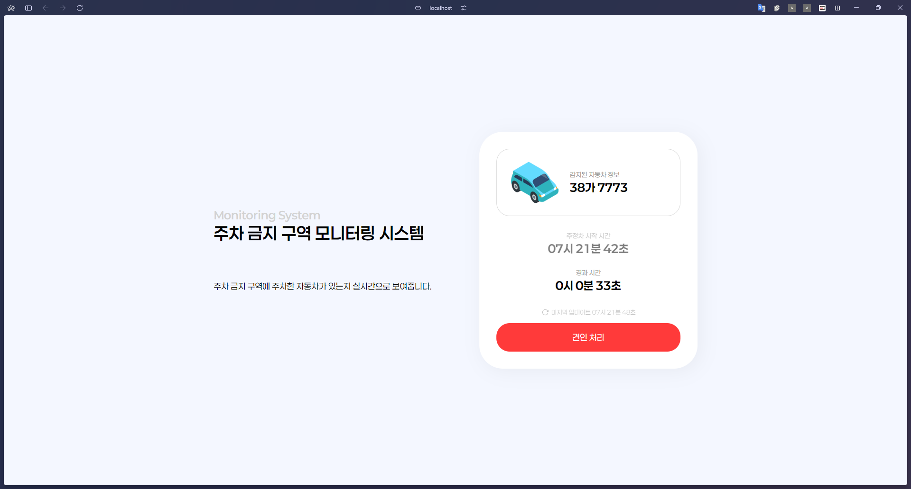
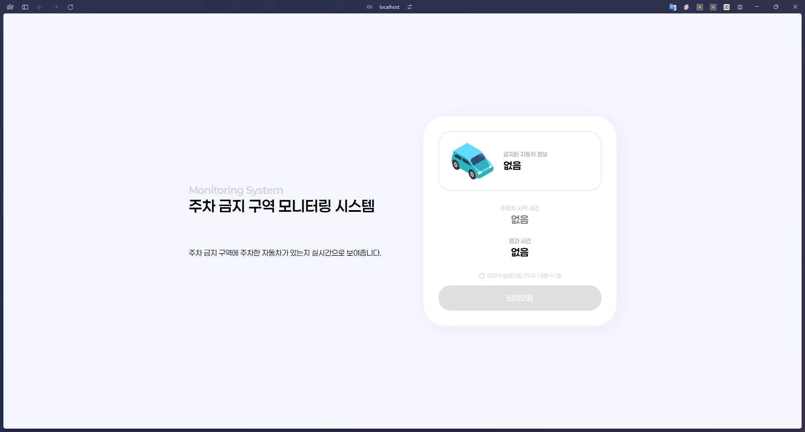
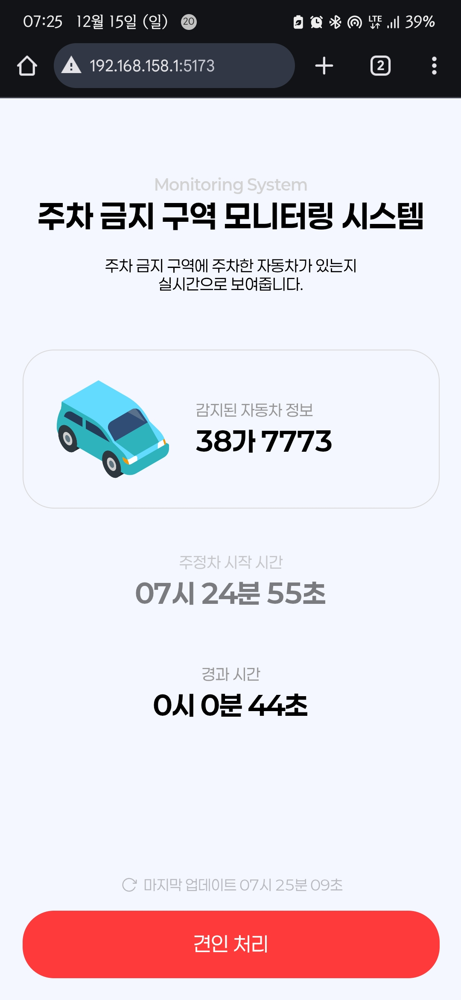
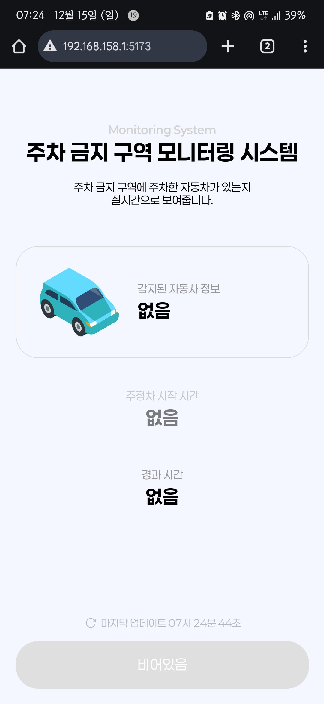

# 불법 주정차 감지 시스템

- 서버 및 컨트롤 센터

# Endpoints

- `POST` `./warning`: 표시할 자동차 설정
- `POST` `./clear`: 자동차 정보 초기화
- `GET` `./api/state`: 자동차 정보 확인

# 불법 주정차 중인 차량의 정보를 표시합니다.

- 차량 번호
- 주정차 시작 / 경과 시간

# 디테일 포인트

- 리프레시 버튼 애니메이션
- 반응형 UI (모바일/pc)

# 사용한 프레임워크

- SvelteKit.

